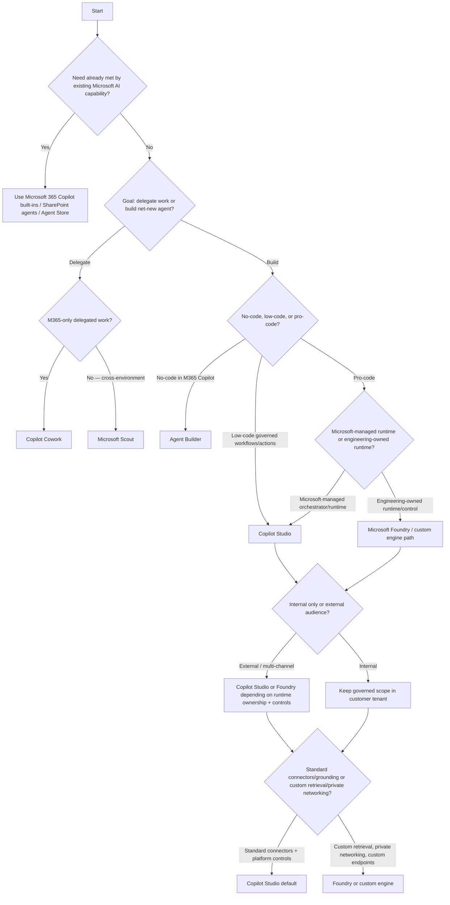

# MSP Reference Architecture — Microsoft AI and Agent Stack

## 1) Scope and audience

**MSP** in this document means **Managed Service Provider**.

This architecture is for:

- MSP cloud architects
- Managed-service leads
- Security and governance teams
- Platform engineers
- Customer success and adoption teams

It covers how an MSP designs and operates Microsoft AI and agent solutions **across multiple customer tenants**.

> **Tenant boundary rule:** This architecture assumes per-customer tenant isolation. Do **not** pool customer production data, identities, secrets, indexes, transcripts, or other customer content across customers.

---

## 2) Architecture principles

- **Tenant isolation first:** Separate customer identity, data, telemetry, and operations.
- **Least privilege by default:** Role-based access, just-in-time elevation, and scoped service identities.
- **Customer-owned control planes:** Production data/control remain in customer tenant/subscription wherever possible.
- **Delegated administration where supported:** Use partner delegation models only with explicit customer approval.
- **Reusable templates, separate deployments:** Reuse IaC/policy templates; deploy per customer.
- **Policy as code:** Enforce guardrails through codified controls and CI/CD gates.
- **Human approval for consequential actions:** Require approvals for sensitive writes, outbound actions, and escalation paths.
- **Measurable quality:** Evaluate behavior before release and continuously in production.
- **Explicit GA/preview gates:** Track preview dependencies; do not treat preview as production baseline by default.

---

## 3) Layered reference architecture

```mermaid
flowchart TB
  subgraph MSP["MSP tenant / management plane"]
    MSP_LZ[Per-customer landing-zone templates]
    MSP_CICD[CI/CD + policy-as-code gates]
    MSP_CATALOG[Service catalog + runbooks]
    MSP_ITSM[ITSM + service review cadence]
    MSP_FINOPS[FinOps + chargeback models]
  end

  subgraph CUST["Customer tenant"]
    subgraph USER["User & channel layer"]
      U_M365[Microsoft 365 Copilot surfaces\n(Chat, Search, app-native, Agent Store)]
      U_TEAMS[Teams]
      U_WEB[Websites / apps / APIs]
      U_DESKTOP[Desktop / browser contexts]
    end

    subgraph EXP["Experience & agent layer"]
      E_BUILTIN[Built-in Microsoft 365 agents]
      E_SP[SharePoint agents]
      E_AB[Agent Builder declarative agents]
      E_CW[Copilot Cowork]
      E_SC[Microsoft Scout]
      E_CS[Copilot Studio agents/workflows/computer use]
      E_FO[Microsoft Foundry prompt + hosted/code agents]
      E_CE[Custom engine agents (developer-owned runtime)]
    end

    subgraph ORCH["Orchestration & integration layer"]
      O_M365[Microsoft 365 Copilot orchestrator + Work IQ]
      O_CS[Copilot Studio harnesses + workflows]
      O_FO[Foundry Agent Service / custom runtimes]
      O_PPA[Power Automate + Dataverse]
      O_CONN[Connectors + API plugins + MCP/tools]
      O_APIM[Azure API Management]
      O_EVT[Business events / schedules / triggers]
    end

    subgraph DATA["Data & knowledge layer"]
      D_M365[Microsoft 365 data + SharePoint]
      D_CON[Copilot connectors]
      D_DV[Dataverse / Dynamics]
      D_FAB[Fabric / OneLake]
      D_RAG[Azure AI Search + custom RAG indexes]
      D_DB[Databases / data lakes]
      D_WEB[Approved public/web content]
    end

    subgraph SEC["Security & governance layer"]
      S_ENTRA[Entra ID + Conditional Access + PIM + RBAC]
      S_MI[Managed identities + Key Vault]
      S_PURVIEW[Purview + DLP + audit]
      S_DEF[Defender]
      S_POLICY[Azure Policy + Power Platform DLP/env policy]
      S_NET[Private networking / private endpoints]
      S_INV[Agent inventory/admin views]
    end

    subgraph OPS["Operations layer"]
      OP_M365[Microsoft 365 admin center]
      OP_PPAC[Power Platform admin center]
      OP_FO[Foundry/Azure operations]
      OP_MON[Azure Monitor + App Insights + Log Analytics]
      OP_SIEM[Microsoft Sentinel]
      OP_EVAL[Evaluation + tracing + quality gates]
      OP_IR[Incident response + rollback/disable]
      OP_REP[Service & KPI reporting]
    end
  end

  MSP_LZ --> CUST
  MSP_CICD --> ORCH
  MSP_CATALOG --> OPS
  MSP_ITSM --> OP_IR
  MSP_FINOPS --> OP_REP

  USER --> EXP --> ORCH --> DATA
  SEC --- USER
  SEC --- EXP
  SEC --- ORCH
  SEC --- DATA
  OPS --- EXP
  OPS --- ORCH
  OPS --- DATA
```

### Boundary controls that must remain explicit

- MSP management services can be standardized, but **customer production execution is isolated per tenant/subscription/environment**.
- No shared production identities, secrets, retrieval indexes, or transcripts across customers.
- Monitoring can use shared tooling patterns, but data stores/workspaces and customer-visible reports stay customer-segregated.

---

## 4) Component selection matrix

| Component | Use when | Avoid / escalate when | Primary builder persona | Runtime owner | Typical channels | Governance tier | MSP service responsibility |
|---|---|---|---|---|---|---|---|
| Microsoft 365 Copilot | Built-in productivity, chat/search/app assistance covers need | Need delegated multi-step automation, external channels, or custom runtime | End user / productivity lead | Microsoft | M365 apps, Teams, web | Zone 1 | Adoption, usage governance, policy baseline |
| Built-in Microsoft 365 agents / Agent Store | Microsoft-delivered specialized tasks fit use case | Need custom logic/control/data beyond built-ins | End user / business lead | Microsoft | Microsoft 365 Copilot | Zone 1 | Curate approved agents, lifecycle communications |
| Copilot Cowork | Delegated bounded/scheduled/event-triggered M365 work with approval | Need cross-environment desktop/browser/local autonomy | End user / team lead | Microsoft | Microsoft 365 Copilot | Zone 1→2 | Enablement, approval guardrails, run-cost governance |
| Microsoft Scout | Personal always-on Autopilot across desktop/browser/local + M365 (Frontier) | Enterprise unattended UI automation requirements | Power user / individual contributor | Microsoft (preview service model) | Desktop app + browser + M365 | Zone 1 (gated) | Preview gating, endpoint policy, risk controls |
| SharePoint agents | Site/library-scoped Q&A | Need actions/workflows/external systems | Site owner / content owner | Microsoft | SharePoint, Teams, M365 Copilot | Zone 1 | Information architecture and permissions review |
| Agent Builder | No-code declarative M365 Copilot helper without Actions | Need actions, external API integration, or external channels | Business SME | Microsoft 365 Copilot orchestrator | M365 Copilot | Zone 1 | Guardrails, lifecycle coaching, migration path to Studio |
| Microsoft 365 Agents Toolkit declarative agents/API plugins | Pro-code declarative/plugin extensibility while staying on M365 orchestrator | Need custom runtime/models/networking or broad low-code governance | Pro developer | Microsoft 365 Copilot orchestrator | M365 Copilot, Teams | Zone 2 | Dev standards, CI/CD templates, plugin security review |
| Copilot Studio agents | Governed low-code agents with actions/connectors/channels | Need engineering-owned runtime/private infra beyond platform limits | Maker + IT | Microsoft-managed platform runtime | M365, Teams, web, channels | Zone 2 | Platform ops, environment strategy, connector governance |
| Copilot Studio workflows | Deterministic triggers/branching/handoffs/approvals | Need adaptive custom-engine orchestration or heavy code frameworks | Maker + IT | Microsoft-managed platform runtime | Power Platform + connected channels | Zone 2 | ALM pipeline, capacity monitoring, change controls |
| Copilot Studio computer use / enterprise UI automation | Legacy UI automation in governed enterprise pattern | Personal cross-environment autopilot scenario (use Scout) | Automation engineer / IT | Microsoft-managed platform runtime | Enterprise app/desktop automation | Zone 2→3 | Credential governance, supervision model, auditability |
| Microsoft Foundry prompt agents | Need managed hosted agent endpoint with deeper runtime control | Need purely no-code/maker-first path | Pro developer / AI engineer | Customer-owned engineering on Azure platform primitives | Apps, APIs, M365/Teams publish paths | Zone 3 | Landing zone, platform security, SRE controls |
| Microsoft Foundry hosted/code agents | Need custom frameworks, protocols, model/runtime control at scale | Scenario fits Copilot Studio governed low-code | Pro developer / platform engineer | Customer engineering team | Apps, APIs, services, multi-channel | Zone 3 | DevSecOps, observability, resiliency, release governance |
| Custom engine agents / Microsoft 365 Agents SDK (or equivalent) | Need developer-owned orchestrator/runtime while integrating with Microsoft surfaces | Requirement can stay fully on Microsoft-managed orchestrator | Pro developer / architect | Customer engineering team | Apps/APIs + optional M365 integration | Zone 3 | Architecture assurance, secure SDLC, integration patterns |
| Azure AI Search / custom RAG | Need custom retrieval, private indexes, ACL-aware grounding | Standard connector grounding is sufficient | Data/AI engineer | Customer engineering team | Foundry, apps, APIs | Zone 2→3 | Data onboarding, indexing ops, retrieval quality testing |
| Microsoft Fabric / OneLake grounding | Analytics-centric grounding and enterprise data estate alignment | Need only lightweight M365 content grounding | Data platform engineer | Customer data platform team | BI + agent experiences | Zone 2→3 | Data governance alignment, semantic model integration |
| AI Builder / Power Platform AI capabilities | Embedded AI in low-code business workflows | Need pro-code custom runtime/model routing | Maker + IT | Microsoft-managed service | Power Platform apps/flows | Zone 2 | Environment governance, model usage and DLP controls |

---

## 5) Decision flow (aligned to Advisor taxonomy)



### Runtime-ownership rule from scoring guidance

When Copilot Studio and Foundry are the top two viable options and close in fit, use runtime ownership as the discriminator:

- **Microsoft-managed runtime preference** → Copilot Studio path
- **Engineering-owned runtime/infrastructure requirement** → Foundry/custom engine path

---

## 6) MSP landing-zone pattern (per customer)

**Repeatable pattern (deploy per customer, never pooled):**

- [ ] Customer-specific Entra groups, privileged roles, and access-review schedule
- [ ] Power Platform environments segmented by lifecycle/risk (`dev/test/prod` + high-risk isolation)
- [ ] Azure hierarchy for Foundry and supporting services (management groups, subscriptions, resource groups)
- [ ] Private networking and private endpoints where required
- [ ] Customer-owned Key Vault, managed identities, and secret rotation controls
- [ ] CI/CD promotion with approval gates (security, architecture, business owner)
- [ ] Separate telemetry workspaces, retention policies, incident records
- [ ] Reused templates/policy packs without shared customer data

---

## 7) Governance tiers (three-zone model)

| Zone | Typical components | Admission criteria | Required controls | Release gates | Ops expectations |
|---|---|---|---|---|---|
| Zone 1 — personal/team productivity | Microsoft 365 Copilot, built-in agents, SharePoint agents, Agent Builder, limited Cowork/Scout | Bounded internal use, low-risk actions, no sensitive custom integration | Baseline identity controls, DLP, approved connectors/agents, scoped permissions | Business owner + security baseline check | Light operations, adoption telemetry, periodic access review |
| Zone 2 — partnered departmental solutions | Copilot Studio agents/workflows, Agents Toolkit declarative/API plugins, AI Builder, Dataverse integrations | Department process impact, managed actions/connectors, formal owner | Environment strategy, DLP policy, ALM, approval checkpoints, monitoring | Architecture/security review + test evidence | Managed platform operations, incident playbooks, monthly service review |
| Zone 3 — professional/mission-critical | Foundry prompt/hosted agents, custom engine agents, private RAG/networking, enterprise UI automation | Critical process, external impact, strict compliance, runtime ownership requirements | Full DevSecOps, private networking, key management, SRE controls, red-team/evaluation | Formal go-live board with rollback and kill switch | 24x7-ready observability model, SLO tracking, major incident process |

---

## 8) MSP managed service catalog

| Service | Typical deliverables | Operational cadence |
|---|---|---|
| AI readiness and tenant baseline | Current-state assessment, control baseline, prioritized adoption map | Initial + quarterly refresh |
| Microsoft 365 Copilot adoption and governance | Enablement plan, policy baseline, approved-agent catalog, adoption dashboards | Monthly governance + quarterly optimization |
| Agent intake/triage using Advisor taxonomy | Intake rubric, component decision records, zone assignment | Weekly intake board |
| Citizen-developer guardrails and review | Maker guardrails, review checklist, escalation triggers to Zone 2/3 | Biweekly office hours + release review |
| Copilot Studio managed platform service | Environment ALM, connector governance, workflow/agent operations runbooks | Weekly operations + monthly service review |
| Foundry managed landing zone and runtime service | Azure landing zone, secure pipeline, observability baseline, SRE playbooks | Continuous ops + monthly reliability review |
| Retrieval/data grounding service | Data-source onboarding, indexing standards, retrieval eval harness | Biweekly quality review |
| AI security/compliance operations | Threat/risk register, access review evidence, audit support | Monthly control review |
| Evaluation, red teaming, monitoring, incident response, optimization | Eval scorecards, safety tests, incident drills, performance tuning plans | Monthly eval cycle + incident-driven updates |
| Licensing/capacity/FinOps reporting | Capacity/cost dashboards, anomaly reports, optimization backlog | Monthly with quarterly business review |

---

## 9) Operational model and SLO categories

### Ownership and RACI model (example)

- **Customer product/process owner:** Business outcomes, acceptance criteria, risk acceptance
- **Customer security/compliance owner:** Control approval and audit posture
- **MSP platform owner:** Platform reliability, change execution, service reporting
- **MSP engineering owner:** Build quality, release safety, remediation

### Lifecycle model

1. Service onboarding and zone classification
2. Inventory registration (agents, connectors, plugins, prompts, workflows, data sources)
3. Evaluation baseline before production
4. Release management with staged promotion and approvals
5. Continuous monitoring and incident handling
6. Periodic drift and access reviews
7. Cost anomaly and business KPI reviews
8. Exit/offboarding runbook (data retention, key revocation, access removal)

### Example SLO categories (not Microsoft product SLAs)

- **Service availability objective** for MSP-managed solution components
- **Latency objective** for key user journeys/API interactions
- **Change failure rate** and rollback execution time
- **Incident response/restore targets** by severity tier
- **Evaluation quality thresholds** (task success, groundedness, safety regressions)
- **Security operations objectives** (access-review completion, critical finding remediation times)

---

## 10) Security threat model (MSP view)

| Threat | Example risk | Microsoft controls | MSP process controls |
|---|---|---|---|
| Prompt injection | Agent follows malicious instructions from retrieved content | Content filtering, grounding boundaries, Entra-protected tool access | Prompt-defense patterns, eval test cases, release gates |
| Data exfiltration / oversharing | Sensitive data appears in responses/actions | Purview, DLP, sensitivity labels, Conditional Access | Data classification onboarding, least-privilege reviews |
| Malicious tools/plugins/MCP servers | Unsafe external action execution | Approved connector/plugin inventories, RBAC, managed identities | Tool allow-list process, security review before enablement |
| Excessive agent permissions | Agent can access/modify more than needed | Entra RBAC, PIM, scoped identities | Quarterly access recertification, break-glass controls |
| Identity confusion / privilege crossover | Human vs agent identity misuse | Managed identities, Entra sign-in controls | Identity architecture standards and threat modeling |
| Cross-tenant mistakes | Operations run against wrong customer assets | Tenant-scoped service principals/subscriptions | Strict tenant tagging, runbook checks, automation guardrails |
| Unsafe autonomous actions | High-impact action without approval | Approval checkpoints, workflow controls | Consequential-action policy and exception logging |
| Poisoned grounding data | Compromised knowledge source biases output | Data-source ACLs, defender tooling, audit logs | Source onboarding validation, periodic source integrity checks |
| Secret leakage | Keys/tokens exposed in prompts/code/logs | Key Vault, secret scanning, managed identities | CI secret scanning, rotation policy, incident playbook |
| Model/output risk | Harmful or non-compliant content | Safety filters, policy configuration, monitoring | Red teaming, human review for high-impact scenarios |
| Supply-chain/CI risk | Compromised dependency/pipeline | Signed artifacts, policy gates, Defender for DevOps controls | Secure SDLC, dependency review, separation of duties |

---

## 11) Example workload patterns

| Workload | Recommended components | Why this fit |
|---|---|---|
| Internal SharePoint knowledge assistant | SharePoint agents or Agent Builder; optionally Microsoft 365 Copilot Chat entry | Site/library-scoped Q&A is fastest in SharePoint agents; escalate to Builder if broader Copilot experience needed |
| Department approvals + Dataverse workflow | Copilot Studio workflows + Dataverse + Power Platform governance | Deterministic approvals/actions and low-code ALM are Zone 2 defaults |
| External customer-service agent | Copilot Studio or Foundry depending on runtime ownership and channel/compliance needs | External audience + multichannel and governed controls require enterprise platform path |
| Custom application with private RAG/networking | Foundry hosted/code agents + Azure AI Search/custom RAG + private endpoints + Key Vault | Requires engineering-owned runtime, private networking, and custom retrieval |
| Delegated personal productivity scenario | Microsoft 365 Copilot (interactive), Cowork (bounded/scheduled M365 delegation), Scout (cross-environment always-on personal Autopilot) | Distinguishes use-vs-delegate paths without treating Scout as enterprise desktop automation |
| Legacy enterprise UI automation (optional pattern) | Copilot Studio computer use / Windows 365 for Agents | Enterprise governed UI automation differs from personal Scout Autopilot |

---

## 12) Adoption roadmap

1. **Assess:** Capability map, tenant posture, and workload inventory
2. **Establish guardrails:** Identity, data, policy, and zone admission model
3. **Pilot Zone 1:** Microsoft 365 Copilot/built-ins/SharePoint/Builder with adoption telemetry
4. **Stand up Zone 2 platform:** Copilot Studio environments, ALM, connector governance, intake board
5. **Launch Zone 3 landing zone:** Foundry/custom-engine secure runtime and SRE controls
6. **Operationalize managed services:** Formal catalog, RACI, reporting, and incident routines
7. **Continuously optimize:** Evaluation, red-team cycles, cost and KPI tuning

---

## 13) Assumptions and verification

- Microsoft AI capabilities, licensing, regional availability, and preview/GA status change frequently.
- Treat repository metadata as the internal guidance anchor:
  - `apa.yaml` → `meta.guidance_verified`
  - `apa.yaml` → `meta.last_updated`
- Validate each customer design against current Microsoft documentation before implementation.

### Authoritative references already used by the Advisor

- Microsoft 365 Copilot overview: <https://learn.microsoft.com/microsoft-365/copilot/microsoft-365-copilot-overview>
- Microsoft 365 Agents Toolkit / agents extensibility overview: <https://learn.microsoft.com/microsoft-365/copilot/extensibility/agents-overview>
- Copilot Studio docs hub: <https://learn.microsoft.com/microsoft-copilot-studio/>
- Copilot Studio workflows: <https://learn.microsoft.com/microsoft-copilot-studio/workflows-experience/flows-overview>
- Microsoft Foundry resources hub (repo-linked): <https://microsoft.github.io/agent-resources/microsoft-foundry/>
- Copilot Cowork overview: <https://learn.microsoft.com/microsoft-365/copilot/cowork/>
- Microsoft Scout overview: <https://learn.microsoft.com/microsoft-scout/overview>
- SharePoint agents getting started: <https://support.microsoft.com/office/get-started-with-sharepoint-agents-69e2faf9-2c1e-4baa-8305-23e625021bcf>
- Custom engine agents overview: <https://learn.microsoft.com/microsoft-365/copilot/extensibility/overview-custom-engine-agent>

### MSP delegation caveat

Delegated-management features vary by service, tenant, and licensing. Treat partner delegation patterns as **tenant-by-tenant validated controls**, and explicitly mark preview-only delegation features before production use.
