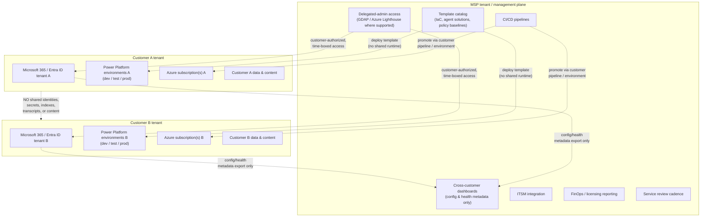
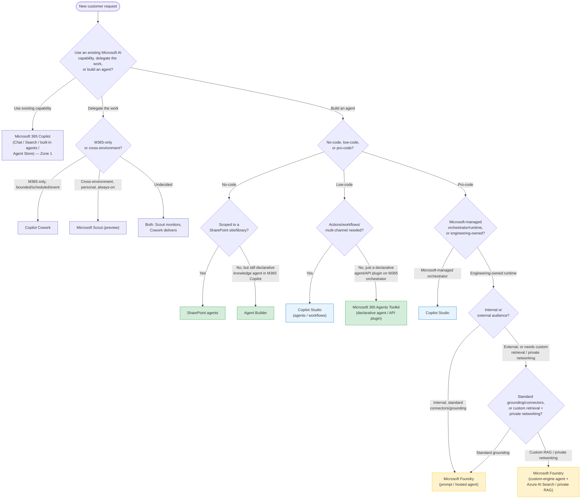

# MSP Reference Architecture — Microsoft AI and Agent Stack

Reference architecture for a Managed Service Provider (MSP — a company that designs, deploys, secures, and operates IT/AI services on behalf of customers under a service contract) delivering Microsoft AI and agent solutions across multiple, separately-managed customer tenants.

This document is grounded in the same platform taxonomy, scoring rules, and terminology as the rest of this repository ([`apa.yaml`](../apa.yaml), [`docs/SCORING.md`](SCORING.md), [`docs/FLOWCHART.md`](FLOWCHART.md), [`README.md`](../README.md)). It does not change any scoring, routing, or recommendation behavior in the app — it is guidance for MSPs designing services *around* the platforms this tool already recommends.

## 1. Scope and audience

- **MSP** = Managed Service Provider: an organization that designs, deploys, secures, and operates Microsoft AI/agent solutions for multiple customers under ongoing service agreements, as distinct from a single in-house IT/AI team building for one organization.
- **Intended readers:** MSP cloud architects, managed-service leads, security/governance teams, platform engineers (Power Platform, Azure, Microsoft 365), and customer success/account teams who scope and sell these services.
- **Tenant model:** every customer has its own Microsoft Entra ID tenant, Microsoft 365 tenant, Power Platform environments, and Azure subscriptions. **Nothing in this architecture implies pooling customer data, identities, indexes, or conversation content across customers.** Any shared MSP infrastructure (templates, CI/CD, monitoring dashboards, ITSM) operates on metadata/configuration only, never on customer content, unless a customer explicitly contracts a shared-tenant offering — which is out of scope here.
- This document is a **pattern**, not a product. It does not assert that Microsoft ships an "MSP mode" for any of these products; delegated administration is called out per-service in [Section 6](#6-msp-landing-zone-pattern) and [Section 13](#13-assumptions-and-verification), and is only claimed where it is a documented capability (for example, Microsoft 365 Lighthouse/GDAP for core Microsoft 365 tenant administration). Where no delegated-management feature is documented, this architecture defaults to **tenant-by-tenant, customer-authorized access** rather than assuming a cross-tenant control feature exists.

## 2. Architecture principles

| Principle | What it means in practice |
|---|---|
| **Tenant isolation** | No customer's identities, secrets, data, indexes, transcripts, or telemetry are stored or processed in another customer's context, or in a shared MSP data plane. |
| **Least privilege** | MSP staff and service principals get the minimum Entra ID roles/scopes needed for their task, time-boxed via Privileged Identity Management (PIM) where available. |
| **Customer-owned data and control planes** | The customer tenant, subscription, and data remain the customer's; the MSP operates *within* customer-authorized boundaries, not a parallel shadow system. |
| **Delegated administration where supported** | Use documented delegation mechanisms (for example Microsoft 365 Lighthouse / Granular Delegated Admin Privileges, Azure Lighthouse) instead of standing local admin accounts, and only where the product actually supports it. |
| **Reusable but separately deployed templates** | Infrastructure-as-code, agent templates, and Copilot Studio/Foundry solution packages are versioned once and deployed per customer — never a live shared instance. |
| **Policy-as-code** | Governance guardrails (Conditional Access, Purview DLP, Azure Policy, Power Platform environment/data policies) are defined in source control and applied consistently per tenant, not configured by hand each time. |
| **Human approval for consequential actions** | Any agent action with real-world effect outside a sandbox (sending externally, writing to a system of record, spending money, changing access) requires an explicit approval step until proven safe at scale. |
| **Measurable quality** | Every agent in Zone 2/3 (see [Section 7](#7-governance-tiers)) has an evaluation baseline, success metric, and drift check before and after go-live. |
| **Explicit GA/preview gates** | Preview and Frontier-labeled capabilities (for example Microsoft Scout, some Foundry Agent Service features) are called out as such in every customer-facing design document and are not used for production/mission-critical workloads without an explicit, documented customer risk acceptance. |

## 3. Layered reference architecture

### 3.1 Full stack, per customer tenant

```mermaid
flowchart TB
    subgraph USERS["User & Channel Layer"]
        U1["Microsoft 365 Copilot surfaces\n(Copilot Chat, Search, in-app)"]
        U2["Microsoft Teams"]
        U3["Websites / custom apps / APIs"]
        U4["Desktop & browser context\n(Scout, computer use)"]
    end

    subgraph EXP["Experience / Agent Layer"]
        E1["Built-in M365 agents\n(Researcher, Analyst, Facilitator, Interpreter)"]
        E2["SharePoint agents\n(site/library Q&A)"]
        E3["Agent Builder\ndeclarative agents"]
        E4["Copilot Cowork\n(delegated M365 work)"]
        E5["Microsoft Scout\n(personal cross-environment Autopilot)"]
        E6["Copilot Studio agents & workflows"]
        E7["Foundry / custom-engine agents"]
    end

    subgraph ORCH["Orchestration & Integration Layer"]
        O1["Microsoft 365 Copilot orchestrator"]
        O2["Copilot Studio harnesses / workflows"]
        O3["Foundry Agent Service /\ncustom runtimes (Agents SDK)"]
        O4["Microsoft Graph / Work IQ"]
        O5["Connectors, Dataverse,\nPower Automate, API plugins"]
        O6["MCP servers / tools"]
        O7["Azure API Management"]
        O8["Event sources\n(webhooks, queues, schedules)"]
    end

    subgraph DATA["Data / Knowledge Layer"]
        D1["Microsoft 365 / SharePoint"]
        D2["Copilot connectors\n(3rd-party content)"]
        D3["Dataverse / Dynamics 365"]
        D4["Microsoft Fabric / OneLake"]
        D5["Azure AI Search / custom RAG"]
        D6["Databases / data lakes"]
        D7["Approved public/web content"]
    end

    subgraph SEC["Security & Governance Layer"]
        S1["Microsoft Entra ID"]
        S2["Conditional Access · PIM · RBAC ·\nmanaged identities"]
        S3["Microsoft Purview\n(DLP, audit, sensitivity labels)"]
        S4["Microsoft Defender"]
        S5["Azure Policy"]
        S6["Power Platform environment\n& data loss prevention policies"]
        S7["Key Vault"]
        S8["Private networking\n(Private Link, VNets)"]
        S9["Agent inventory / admin\n(Agent 365-style visibility)"]
    end

    subgraph OPS["Operations Layer"]
        P1["Microsoft 365 admin center"]
        P2["Power Platform admin center"]
        P3["Foundry control / operations views"]
        P4["Azure Monitor · App Insights ·\nLog Analytics"]
        P5["Microsoft Sentinel"]
        P6["Cost management"]
        P7["Evaluation & tracing"]
        P8["Incident response"]
        P9["Service reporting"]
    end

    USERS --> EXP --> ORCH --> DATA
    ORCH --> SEC
    EXP --> SEC
    SEC --> OPS
    ORCH --> OPS
```

### 3.2 MSP management plane wrapping N customer tenants

**Boundary rules (both diagrams):**

- The **MSP tenant/management plane** never holds customer production data, secrets, conversation transcripts, or content — only configuration templates, deployment pipelines, and aggregate/anonymized health metadata.
- Each **customer tenant** (Microsoft 365/Entra ID) and its **Azure subscriptions / Power Platform environments** are independent trust boundaries; a template deployed to Customer A creates a *separate* instance in Customer A's environment, not a shared multi-tenant service instance.
- There is **no cross-customer sharing** of production identities, Key Vault secrets, Azure AI Search indexes, Dataverse tables, conversation/chat transcripts, or any customer content, ever — including for "convenience" shared demo/staging environments.

## 4. Component selection matrix

| Component | Use when | Avoid / escalate when | Primary builder persona | Runtime owner | Typical channels | Governance tier | MSP service responsibility |
|---|---|---|---|---|---|---|---|
| **Microsoft 365 Copilot** (Chat, Search, in-app) | General knowledge work, drafting, summarizing, Q&A over the user's own M365 content | Needs multi-step actions, external users, or custom data sources | End user | Microsoft-managed | M365 apps, Teams, web | Zone 1 | Licensing, adoption enablement, usage/DLP baseline |
| **Built-in M365 agents / Agent Store** (Researcher, Analyst, Facilitator, Interpreter, 3P Agent Store apps) | Specialized, ready-made task (research, data analysis, meeting facilitation, translation) without building anything | Need a custom knowledge scope or company-specific action | End user | Microsoft-managed | M365 Copilot surfaces | Zone 1 | Catalog curation, admin consent review |
| **Copilot Cowork** | Delegated, bounded Microsoft 365 work: one-shot deliverables, scheduled or event-triggered tasks with approvals | Needs cross-environment (desktop/browser/local) reach, or always-on autonomy outside M365 | Business user | Microsoft-managed | M365 apps, Teams | Zone 1–2 | Task scoping, approval-workflow design, usage review |
| **Microsoft Scout** | Personal, always-on, cross-environment Autopilot (desktop, browser, local files, shell, plus M365) for one user | Enterprise-wide legacy UI automation, or any workload needing formal governance/ALM | End user (personal) | Microsoft-managed (Frontier preview) | Desktop, browser, M365 | Zone 1 (preview — explicit risk acceptance) | Preview enrollment gating, data-boundary review, opt-in management |
| **SharePoint agents** | Site- or library-scoped Q&A over a bounded document set | Needs actions, cross-site retrieval, or external users | Business user / IT pro | Microsoft-managed | M365 Copilot, Teams | Zone 1 | Site/library scoping review, permission audit |
| **Agent Builder** | No-code declarative knowledge agent inside Microsoft 365 Copilot (Q&A, guided prompts) — not actions/workflows | Needs Actions/API calls, multi-step workflows, or external-user access | Business user / low-code maker | Microsoft-managed (M365 Copilot orchestrator) | M365 Copilot | Zone 1 | Template review, publishing approval, lifecycle tracking |
| **Microsoft 365 Agents Toolkit** (declarative agents / API plugins) | Pro-code declarative agents or API plugins that still run on the M365 Copilot orchestrator | Needs a custom orchestrator/runtime, or non-M365 channels | Professional developer | Microsoft-managed (M365 Copilot orchestrator) | M365 Copilot | Zone 1–2 | Source-control/ALM setup, code review, publishing pipeline |
| **Copilot Studio agents** | Governed low-code agent with actions, connectors, multi-channel deployment, internal or external audience | Needs a developer-owned runtime, private networking, or custom model/retrieval architecture | Low-code maker / IT pro | Microsoft-managed | Teams, web, voice, M365 Copilot, custom channels | Zone 2 (Zone 3 for high-stakes external use) | ALM setup, connector governance, eval, monitoring |
| **Copilot Studio workflows** | Deterministic, triggered, multi-step automation (approvals, data movement) with human checkpoints | Needs adaptive, reasoning-heavy multi-agent orchestration | Low-code maker / IT pro | Microsoft-managed | Teams, web, Power Platform | Zone 2 | Workflow design review, approval-gate design, monitoring |
| **Copilot Studio computer use / enterprise UI automation** | Enterprise-scale automation of legacy desktop/web UI (GA), with credentialed, supervised, auditable execution | Personal, single-user always-on automation (that's Scout, not this) | IT pro / RPA developer | Microsoft-managed | Desktop/web UI targets | Zone 2–3 | Credential vaulting, supervision/observability setup, cost governance |
| **Microsoft Foundry prompt agents** | Pro-code agent built from a single model/prompt configuration needing Azure-scale control, identity, and networking | Simple Q&A that Agent Builder/Copilot Studio already covers | Professional developer | Engineering-owned | Custom apps, APIs | Zone 3 | Landing-zone provisioning, model/version governance |
| **Microsoft Foundry hosted/code agents** | Custom orchestration logic, multi-agent systems, or bespoke retrieval running on Foundry Agent Service | Simple deterministic workflows better served by Copilot Studio workflows | Professional developer / AI engineer | Engineering-owned | Custom apps, APIs, event-driven | Zone 3 | Runtime SRE, eval/tracing, incident response |
| **Custom engine agents / Agents SDK (or equivalent)** | Fully developer-owned orchestrator/runtime, custom memory, and integration patterns that must run outside Microsoft-managed orchestration | Any scenario a managed harness already satisfies — avoids reinventing eval, memory, and connector plumbing | Data scientist / AI engineer | Engineering-owned | Any (custom) | Zone 3 | Full DevSecOps ownership, SDK version management |
| **Azure AI Search / custom RAG** | Private, high-relevance retrieval over proprietary or sensitive content that standard connectors can't reach or index acceptably | Content already well-served by Microsoft 365/Copilot connectors or Dataverse | Professional developer | Engineering-owned | Behind Foundry/custom-engine agents | Zone 3 | Index lifecycle, data classification, freshness SLAs |
| **Microsoft Fabric / OneLake analytics grounding** | Agent needs to reason over curated enterprise analytics/lakehouse data at scale | Simple document Q&A better served by SharePoint/Copilot connectors | Data engineer / AI engineer | Engineering-owned (data platform team) | Behind Copilot Studio/Foundry agents | Zone 2–3 | Data-product governance, lineage, access control |
| **AI Builder / Power Platform AI capabilities** | Prebuilt or custom AI models (forms processing, prediction, classification) embedded in Power Platform apps/flows | Needs a full conversational/agentic experience — use Copilot Studio instead | Low-code maker | Microsoft-managed | Power Apps, Power Automate | Zone 2 | Model selection review, capacity/credit tracking |

This matrix mirrors — and must stay consistent with — the platform positioning in [`apa.yaml`](../apa.yaml) and [`README.md`](../README.md#current-platform-positioning). If those files change platform positioning, update this table in the same change.

## 5. Decision flow

This flow is a **service-scoping aid**, not a replacement for the live tool. When Copilot Studio and Foundry are both plausible and close, run the actual [assessment](../README.md#user-paths) so the conditional runtime-ownership question (q9, documented in [`docs/SCORING.md`](SCORING.md)) is applied consistently: Microsoft-managed operation prefers Copilot Studio; engineering-owned operation requires Foundry and hard-disqualifies Agent Builder and Copilot Studio.

## 6. MSP landing-zone pattern

A repeatable, per-customer deployment model. Every item below is instantiated **once per customer** from a shared template — never shared at runtime.

- **Identity:** customer-specific Entra ID security/PIM-eligible groups for MSP staff (for example `MSP-<Customer>-CopilotStudio-Admins`), scoped to the minimum roles required; no standing Global Admin accounts.
- **Power Platform environment strategy:** separate Development / Test / Production environments per customer, with environment-level DLP policies and a distinct "quarantine"/sandbox environment for citizen-developer experimentation (risk zone) isolated from managed production.
- **Azure structure:** a dedicated management group and subscription(s) per customer (or a clearly segregated subscription within the customer's own tenant) for Foundry projects and supporting data services (Azure AI Search, databases); resource groups separate workload tiers (landing zone, data, agent runtime).
- **Network isolation:** Private Link / private endpoints for Azure AI Search, storage, and Foundry resources in Zone 3 workloads; no public network access to production data services handling customer content.
- **Secrets and identity:** a customer-owned Key Vault per environment tier, accessed via managed identities — never MSP-shared service principals with static secrets.
- **CI/CD:** pipelines defined once in the MSP template catalog, but each customer's pipeline runs against that customer's own service connections/environments, with manual approval gates before promotion to production.
- **Telemetry and incidents:** separate Log Analytics workspaces / Application Insights resources per customer; incident tickets and postmortems are filed per customer, never aggregated into a single cross-customer incident record.
- **Template reuse without data sharing:** the template catalog version-controls infrastructure-as-code, Copilot Studio solution packages, and Foundry project scaffolding — deploying a template creates a new, isolated instance per customer; it never points multiple customers at one running instance.

## 7. Governance tiers

| Zone | Scope | Admission criteria | Required controls | Release gates | Operations expectations |
|---|---|---|---|---|---|
| **Zone 1 — Personal/team productivity** | Built-in Microsoft 365 Copilot, SharePoint agents, Agent Builder | Single team/site scope, internal audience, no sensitive-action automation | Standard M365 licensing, Purview DLP baseline, site permission review | Lightweight publishing review | Usage monitoring, periodic permission re-review |
| **Zone 2 — Partnered departmental solutions** | Copilot Studio agents/workflows, Agents Toolkit, AI Builder, Fabric-grounded scenarios | Department-level or cross-team scope, may include external users, formal ALM required | Connector/action governance, environment DLP, managed identities where applicable, evaluation baseline | Solution-checker pass, security review, staged dev→test→prod promotion with sign-off | Scheduled monitoring, incident SLAs, quarterly access review |
| **Zone 3 — Professional/mission-critical solutions** | Microsoft Foundry (and/or Copilot Studio with private networking/custom retrieval) | External-facing, regulated, or business-critical workloads; custom runtime or retrieval | Private networking, Key Vault-managed secrets, full RBAC/PIM, red-team/eval baseline, DevSecOps pipeline | Security architecture review, load/eval testing, staged rollout with rollback plan | 24x7-capable monitoring (per contract), SRE on-call, drift detection, formal incident response |

## 8. Managed service catalog

| Service | Typical deliverables | Cadence |
|---|---|---|
| **AI readiness & tenant baseline** | Tenant assessment report, licensing gap analysis, Conditional Access/DLP baseline | One-time, refreshed annually |
| **Microsoft 365 Copilot adoption & governance** | Rollout plan, usage dashboards, Agent Store consent policy | Onboarding + quarterly review |
| **Agent intake/triage (using this Advisor's taxonomy)** | Intake form mapped to Zone 1–3, routed to the appropriate platform/service | Continuous, per request |
| **Citizen-developer guardrails & review** | Sandbox environment, DLP policy, periodic Agent Builder/AI Builder audit | Monthly review |
| **Copilot Studio managed platform service** | ALM pipeline, connector catalog, eval dashboards, channel management | Ongoing operations |
| **Foundry managed landing zone & agent runtime service** | Landing-zone IaC, model/version governance, runtime SRE | Ongoing operations |
| **Retrieval/data-grounding service** | Azure AI Search / Fabric grounding design, data classification, freshness SLAs | Project + ongoing maintenance |
| **AI security/compliance operations** | Purview DLP/audit configuration, Defender coverage, access reviews | Continuous + quarterly audit |
| **Evaluation, red teaming, monitoring, incident response** | Eval baselines, red-team report, monitoring dashboards, incident runbooks | Pre-launch + continuous |
| **Licensing/capacity/FinOps reporting** | Copilot Credit/consumption reports, capacity forecast, cost anomaly alerts | Monthly |

## 9. Operational model and SLOs

- **Ownership/RACI:** define per service who is Responsible/Accountable/Consulted/Informed across MSP platform team, MSP security team, and customer stakeholders; document per customer, not assumed globally.
- **Service onboarding:** tenant baseline assessment → landing-zone deployment → pilot agent → governance sign-off → production cutover.
- **Inventory:** maintain a per-customer inventory of every deployed agent/workflow, its Zone, owner, and data sources (aligned with emerging Agent 365-style agent-inventory concepts in the stack, tracked as configuration metadata, not customer content).
- **Evaluation baselines:** every Zone 2/3 agent has a documented pre-launch evaluation (accuracy, safety, groundedness) and a recurring re-evaluation schedule.
- **Release management:** dev → test → prod promotion with explicit approval gates; rollback plan documented before every release.
- **Monitoring:** usage, error rate, latency, and cost dashboards per customer; alert thresholds agreed per Zone.
- **Incident severity:** example categories — Sev1 (agent taking harmful/unauthorized action or full outage of a production Zone 3 workload), Sev2 (degraded accuracy/availability), Sev3 (non-blocking defect); response-time targets are set per customer contract, not asserted here as a Microsoft SLA.
- **Rollback/disable procedures:** every managed agent has a documented, tested "kill switch" (disable publishing, revoke connector consent, or pause runtime) usable within minutes.
- **Drift:** scheduled checks for model/prompt/knowledge drift (for example retrieval index staleness, connector schema changes, model deprecation notices).
- **Access reviews:** quarterly review of MSP staff and service-principal access per customer tenant.
- **Cost anomaly review:** monthly review of Copilot Credit, Azure, and Power Platform consumption against forecast.
- **Business KPI review:** quarterly review tying agent usage to the business outcome it was built for.
- **Customer exit/offboarding:** documented process to hand back or destroy MSP-held access, export configuration/telemetry the customer owns, and revoke all delegated access — leaving no MSP footprint in the customer tenant.

## 10. Security threat model

| Threat | Mitigation (Microsoft controls) | Mitigation (MSP process) |
|---|---|---|
| Prompt injection (malicious instructions in retrieved content) | Content safety filters, grounding source allowlists | Data-source vetting, red-team testing before launch |
| Data exfiltration via agent responses | Purview DLP, sensitivity labels, Conditional Access | Output-channel review, egress monitoring |
| Oversharing (agent surfaces content the user shouldn't see) | M365 permission model respected by Copilot/Graph grounding, SharePoint access reviews | Pre-launch permission audit, "search and site" oversharing assessment |
| Malicious tools/plugins/MCP servers | App consent policies, verified publisher requirements | MCP/plugin allowlist, code/security review before enabling |
| Excessive agent permissions | Least-privilege managed identities, scoped API permissions | Permission review at intake and at every material change |
| Identity confusion (agent acting as user vs. as itself) | Managed identity vs. delegated-permission design in Entra ID | Explicit identity-model documentation per agent |
| Cross-tenant mistakes (wrong customer's data/config touched) | Separate subscriptions/tenants, PIM scoping | Naming conventions, deployment guardrails, two-person review on cross-tenant changes |
| Unsafe autonomous actions | Approval workflows in Cowork/Copilot Studio/Power Automate | Human-in-the-loop policy for consequential actions (Section 2) |
| Poisoned grounding data | Content source validation, versioned indexes | Data pipeline review, source reputation checks |
| Secret leakage | Key Vault, managed identities, no secrets in code/config | Secret scanning in CI/CD, rotation schedule |
| Model/output risk (hallucination, bias, unsafe content) | Content filters, evaluation pipelines | Eval baselines, red teaming, human review gates for high-stakes outputs |
| Supply-chain/CI risk | Verified publisher/marketplace controls, signed pipelines | Dependency review, pipeline hardening, least-privilege service connections |

## 11. Example workload patterns

1. **Internal SharePoint knowledge assistant.** A department needs Q&A over one document library. Use **SharePoint agents** — Zone 1, no-code, scoped to the library's existing permissions. Escalate to Agent Builder or Copilot Studio only if the scope grows beyond one site/library or actions are needed.
2. **Department approvals/Dataverse workflow.** Finance needs a multi-step approval process with a Dataverse-backed request table. Use **Copilot Studio workflows** — Zone 2, deterministic triggers, human approval checkpoints, Dataverse as system of record.
3. **External customer-service agent.** A customer wants an externally facing support agent with connectors to their ticketing system. Use **Copilot Studio agents** — Zone 2 (or Zone 3 if regulated/high-volume), governed low-code, multi-channel, with the external-user hard rule from the scoring model in mind (Agent Builder is excluded for external audiences).
4. **Custom application with private RAG/networking.** A regulated customer needs an agent embedded in their own application, over private, sensitive data with no public network exposure. Use **Microsoft Foundry** custom-engine agent with **Azure AI Search** private RAG behind Private Link — Zone 3, engineering-owned runtime.
5. **Delegated personal productivity scenario.** A single user wants "clean my inbox every Friday" (bounded, scheduled M365 work) versus "watch my desktop and files and act on my behalf all day" (always-on, cross-environment). The first is **Copilot Cowork**; the second is **Microsoft Scout** (preview, personal Autopilot) — never conflate the two, and Scout is not a substitute for enterprise automation.
6. *(Optional)* **Enterprise legacy UI automation.** An enterprise needs to automate a legacy desktop application at scale across many employees, with credentials, supervision, and audit trails. Use **Copilot Studio computer use / Windows 365 for Agents** (GA enterprise automation) — explicitly not Microsoft Scout, which is personal and preview.

## 12. Adoption roadmap

1. **Assess** — tenant baseline, licensing, current agent sprawl, governance gaps.
2. **Establish guardrails** — Conditional Access, Purview DLP, Power Platform environment/DLP policy, MSP template catalog v1.
3. **Pilot Zone 1** — Microsoft 365 Copilot rollout, one or two Agent Builder/SharePoint-agent pilots with tight scope.
4. **Establish Zone 2 platform/ALM** — Copilot Studio managed platform service, connector governance, evaluation baseline process.
5. **Launch Zone 3 landing zone** — Foundry landing zone, private networking, custom retrieval service, DevSecOps pipeline.
6. **Operationalize the managed service** — monitoring, incident response, service reviews, RACI in steady state.
7. **Continuously optimize** — drift detection, cost/FinOps review, KPI review, roadmap re-alignment as Microsoft ships new capabilities.

## 13. Assumptions and verification

- Microsoft AI capabilities, licensing terms, and preview/GA status **change frequently**. Treat every product/feature reference in this document as subject to change and verify against current Microsoft Learn documentation before customer commitments.
- This document's currency should be checked against this repository's `meta.guidance_verified` and `meta.last_updated` fields in [`apa.yaml`](../apa.yaml) — if those dates are older than your review date, re-validate platform positioning before relying on it.
- Authoritative starting points already referenced in `apa.yaml` include: [Microsoft 365 Copilot overview](https://learn.microsoft.com/microsoft-365/copilot/microsoft-365-copilot-overview), [Copilot Studio](https://learn.microsoft.com/microsoft-copilot-studio/), [Copilot Studio harnesses](https://learn.microsoft.com/microsoft-copilot-studio/harnesses-overview), [Copilot Studio workflows](https://learn.microsoft.com/microsoft-copilot-studio/workflows-experience/flows-overview), [Microsoft 365 Agents Toolkit](https://learn.microsoft.com/microsoftteams/platform/toolkit/overview-agents-toolkit), [custom engine agents](https://learn.microsoft.com/microsoft-365/copilot/extensibility/overview-custom-engine-agent), [SharePoint agents](https://support.microsoft.com/office/get-started-with-sharepoint-agents-69e2faf9-2c1e-4baa-8305-23e625021bcf), [Copilot Cowork](https://learn.microsoft.com/microsoft-365/copilot/cowork/), and [Microsoft Scout](https://learn.microsoft.com/microsoft-scout/overview).
- **No unsupported MSP delegated-management claims are made here.** Where a feature (for example Microsoft 365 Lighthouse/GDAP) is asserted, it applies to core Microsoft 365 tenant administration as documented by Microsoft; delegated administration for Copilot Studio and Foundry resources is generally **tenant-by-tenant, customer-authorized access** unless and until Microsoft documents a specific cross-tenant delegation mechanism for those services. Preview-labeled paths (Scout, some Foundry Agent Service capabilities) are labeled as preview throughout this document and must be re-confirmed at delivery time.
